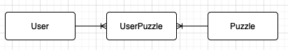

# PuzzleTheque

## Introduction
PuzzleTheque is a puzzle library app. Most people will only complete a jugsaw puzzle one time. Then the puzzle will sit on the shelf, taking up space and collecting dust. Why not just borrow the puzzle? The puzzle gets used more and you don't have to store puzzles.

PuzzleTheque helps facilitate the borrowing of puzzles. Users can login and borrow puzzles. They can also renew and return puzzles. Users can also contribute to the puzzle economy by donating a puzzle. 

## Technologies
Project is created with:
- React 17.0.2
- React-Router 5.2.0
- Ruby 2.6.1
- Rack 2.2
- Shotgun 0.9.2
- Rack-cors 1.1
- JSON 2.5
- Active Record 6.1

## Launch
To launch the backend, cd into the backend directory and run:

```
$ bundle install
$ rake db:migrate
$ rake db:seed
$ shotgun
```
Then to launch the frontend, cd into the frontend directory and run:
```
$ yarn install
$ yarn start
```

## Video Demo
<a href="https://www.loom.com/share/ac4af1c5f89c4b3c958c3842bfc7e63c" target="_blank">PuzzleTheque Walkthrough Video</a>

## Models


- User:
    - name
- Puzzle:
    - name
    - checked_out
    - pieces_missing
    - category
    - img_url
    - num_of_pieces
- UserPuzzle:
    - user_id
    - puzzle_id
    - check_out_date
    - due_date

## User Stories:
Users will be able to:
- [x] log into the application - very basic, just type in username
- [x] Create new user
- [x] Browse available puzzles
- [x] Checkout puzzles - which will add a user_id to puzzle
- [x] View checked out puzzles
- [x] Return puzzles - which will remove the user’s id from the puzzle
- [x] Delete account - removes user from db
- [x] Renew puzzle - doubles the time the user can have the puzzle checked out;
- [x] Contribute to the puzzle economy - if member has extra puzzles to contribute, they can fill in a form and this will add the new puzzle to the DB


## Stretch Goals:
- [ ] Limits on renewing and amount of items that can be checked out at a time
- [ ] Limits on the amount of puzzles that can be checked out by a given user
- [ ] Require user to return all puzzles before deleting account - right now they are taking all our puzzles!!!
- [ ] Users can review puzzles with a rating and text review - this will create a new model, reviews, which will have a one to many relationship with users and puzzles. Will need to alias users as reviewers and puzzles as puzzle_reviews so AR doesn’t get confused.
- [ ] Add a librarian feature so users can’t return their puzzles. Librarian would be a type of user or its own class who has the ability to return puzzles
- [ ] Library fines - a fines column could live on users and users could get fines for late returns; also librarian class could assign fines for damaged puzzles?
- [x] Transform into a Ruby on Rails app
- [ ] Transition to using functional components rather than class components
    ####Components to transition:
    - [ ] Contribute
    - [ ] Login
    - [x] PuzzleCard
    - [x] PuzzleContainer
    - [x] Signup
    - [x] Splash
    - [x] UserContainer
    - [x] UserPuzzleCard
    - [ ] App?

- [ ] Add better User login with proper auth
    - [x] backend
    - [ ] frontend
- [ ] user can change their password
- [ ] Work on better responsive layout
- [ ] Make it so there is a record of what puzzles a user has checked out
    - [x] Add an active attribute to Borrow
    - [x] Borrows are create with Active set to true
    - [x] Active is set to false when the puzzle is returned
    - [x] Borrows no longer have to be destroyed
    - [ ] What happens when a user deletes their account?
        - could delete all borrows associated with user
        - could get rid of delete a user's account, only deactivate
        - could have both options - deactivate and delete user